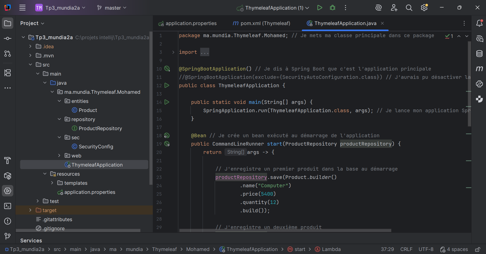
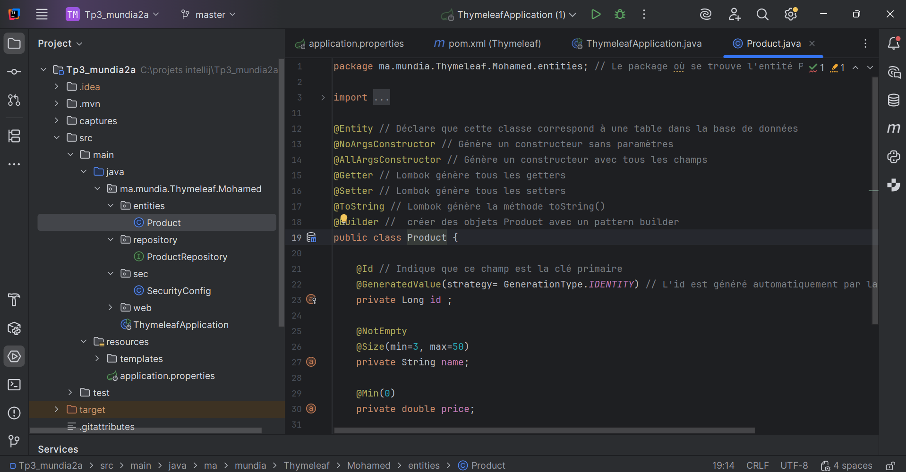
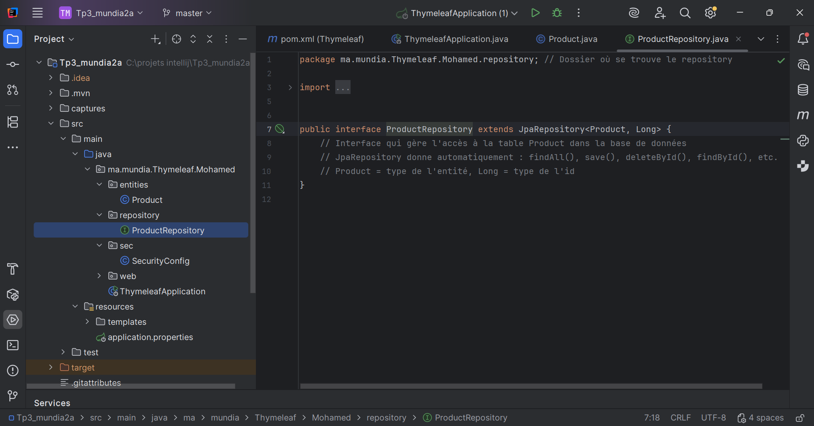
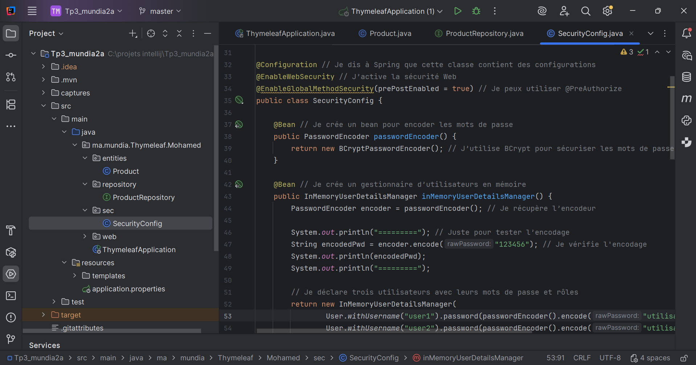
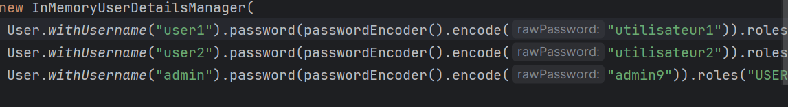
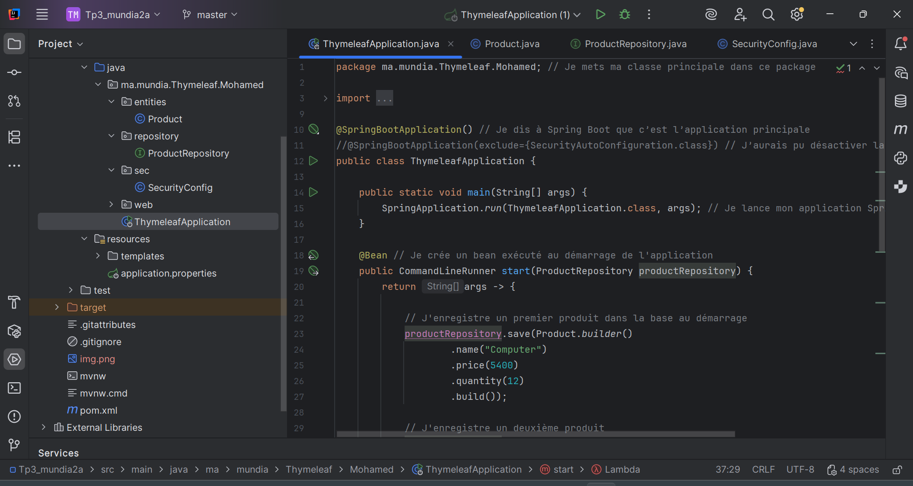
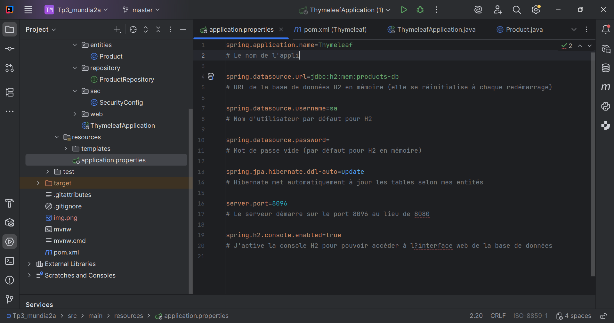
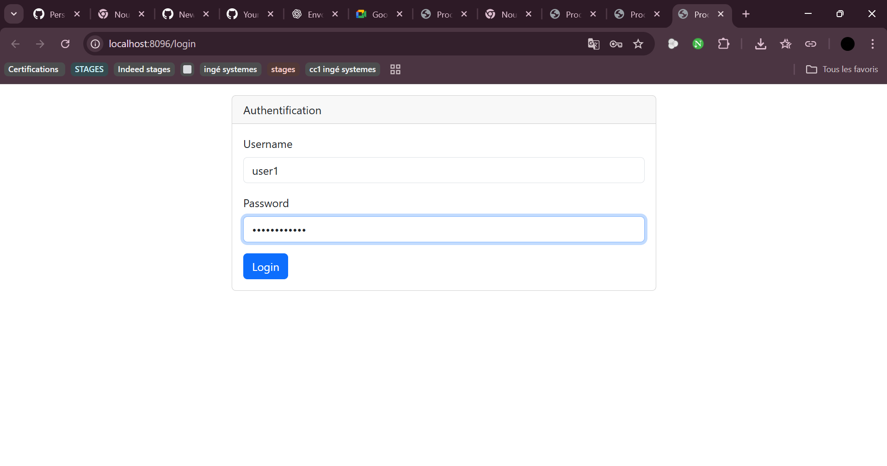
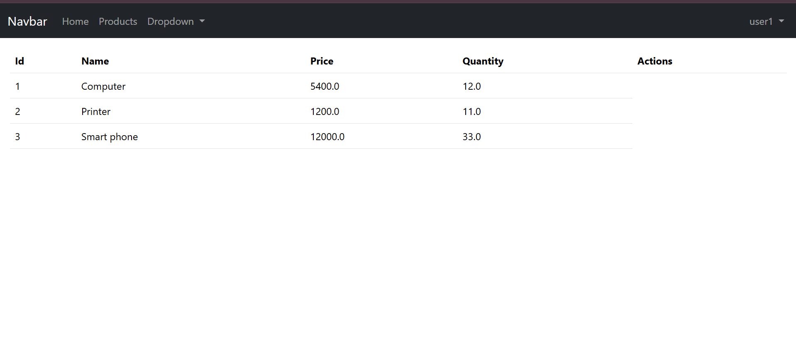

# Tp3_mundia_mvcthymeleaf

Ce projet est un exemple d'application Spring Boot avec Thymeleaf.  
Il permet de gérer des produits dans une base de données, avec affichage dans une interface web simple.

Les captures d'écran sont dans le dossier captures.

---

## Technologies utilisées

- Java 17  
- Spring Boot 3  
- Spring Data JPA  
- Thymeleaf  
- H2 / MySQL  
- Maven  

---

## Fonctionnalités

- Ajouter et afficher des produits  
- Sauvegarde automatique de quelques produits au démarrage  
- Interface web simple avec Thymeleaf  
- Gestion de la base de données via Spring Data JPA

La première image montre le fichier qui contient la méthode principale de lancement de l'application :  

La classe produits : 

L'interface qui gere l'acces a la table produits 

La configuration de securite 

Les username et mots de passe des differents utilisateurs 

La classe qui contient la methode principale de lancement de l'application contient aussi les donnees de base comme vu ici (computer...etc) 

Le fichier des proprietes qui contient toutes les dependances du projet 

On s'authentifie en accedant au lien localhost:8096 
User 1 et son mdp 

La base de donnees s'affiche devant nous avec les donnees entrees 

En s'authentifiant en tant qu'admin on a la meme interface mais on a aussi l'option d'ajouter des produits et de les supprimer 

Ici on teste en ajoutant un produit par exemple 

Le produit est ajoute a la base directement 

## Conclusion

Ce TP permet de se familiariser avec le développement d'une application web Spring Boot utilisant Thymeleaf.  
Il illustre la gestion des données via Spring Data JPA, l'affichage dynamique des produits sur une interface web simple et l'intégration d'une base de données H2/MySQL.  
Grâce à ce projet, on comprend le fonctionnement global d'une application Spring Boot avec Thymeleaf, de la couche back-end à l'affichage front-end.

